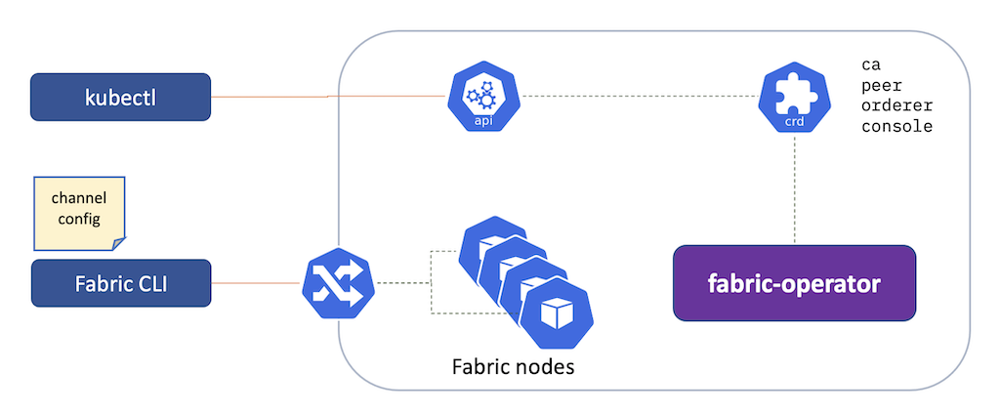

# 部署一个fabric网络

[前一步: 部署一个k8s集群](10-kube-zh.md) <==> [下一步：安装智能合约](30-chaincode-zh.md)

---
[Fabric-operator](https://github.com/hyperledger-labs/fabric-operator)是通过Operator技术使用
[custom resources](https://kubernetes.io/docs/concepts/extend-kubernetes/api-extension/custom-resources/)来部署Hyperledger Fabric网络中[CA](../../infrastructure/sample-network/config/cas)，[peer](../../infrastructure/sample-network/config/peers)，[orderer](../../infrastructure/sample-network/config/orderers)节点的一种工具和方式。最终它会将CA，Peer，Orderer转化为对应的k8s资源，如`Pod`,`Deployment`, `Service`, 和 `Ingress`

一旦Fabric网络启动完成，可以使用`peer`和命令行工具通过Ingress来访问fabric网络。创建通道，合约和应用部署。



## 执行：

```shell

just check-kube

```

## 示例网络

- 安装 fabric-operator [Kubernetes Custom Resources](https://kubernetes.io/docs/concepts/extend-kubernetes/api-extension/custom-resources/)
```shell

kubectl apply -k https://github.com/hyperledger-labs/fabric-operator.git/config/crd

```

- 部署 [CA](../../infrastructure/sample-network/config/cas), [peer](../../infrastructure/sample-network/config/peers),
  和 [orderer](../../infrastructure/sample-network/config/orderers) 资源。并等待operator完成k8s上的资源创建 `Pods`, `Deployments`, `Services`, 和 `Ingress`

```shell

just cloud-network

```

- 建立通道:
```shell

just cloud-channel

```

- 建立TLS证书，channel msp，用户证书创建:
```shell

export WORKSHOP_CRYPTO=$WORKSHOP_PATH/infrastructure/sample-network/temp

```


## 检查

```shell

curl \
  -s \
  --cacert $WORKSHOP_CRYPTO/cas/collectingofficer-ca/tls-cert.pem \
  https://$WORKSHOP_NAMESPACE-collectingofficer-ca-ca.$WORKSHOP_INGRESS_DOMAIN/cainfo \
  | jq

```

## 云原生和peer节点日志

我们可以通过如下方式获取peer节点信息比如peer节点的日志。

```shell
kubectl config set-context --current --namespace=test-network
kubectl get pods
```

假设collectingofficer peer1 pod名称为`collectingofficer-peer1-79df64f8d8-7m9mt`, 我们可以通过如下命令来获取日志，从而观察peer节点上的通道，合约，和落块情况。

```shell
kubectl logs -f collectingofficer-peer1-79df64f8d8-7m9mt peer
```

您也可以使用其他工具如[k9s utility](https://k9scli.io/topics/install/).比如：

```shell
k9s -n test-network
```

You'll see the fabric-operator, peer, orderer, and CA pods. Navigate around by hitting `ENTER` on one of the pods, `ENTER` again on one of the containers, and then hit `0` to tail the container's log. Go back up by hitting `ESCAPE`. More tips are available at the top of the k9s user interface.

## 调试

```shell

# While running "just cloud-network and/or just cloud-channel":
tail -f infrastructure/sample-network/network-debug.log

```


# 进一步拓展:  

- Deploy the [Fabric Operations Console](21-fabric-operations-console.md)
- Build a network with the [Ansible Blockchain Collection](22-fabric-ansible-collection.md)


---

[前一步: 部署一个k8s集群](10-kube-zh.md) <==> [下一步：安装智能合约](30-chaincode-zh.md)
